# Static Frontend Technical Specification for Saving Circles DApp (No Backend)

## 1. Background

### Problem Statement
The SavingCircles smart contract implements a rotating savings and credit association (ROSCA) system on-chain, but requires a completely static frontend with no database or backend. Users need a pure client-side solution to:
- Create and configure saving circles directly on-chain
- Track memberships via contract view methods (getMemberCircles)
- Calculate deposit windows from on-chain timestamps
- Claim funds based on contract state (isWithdrawable)
- Monitor progress through direct contract reads
- Handle failed circles without any persistence layer

### Context / History
- SavingCircles is a decentralized ROSCA implementation built by Breadchain Collective
- Contract uses upgradeable proxy pattern with OpenZeppelin libraries
- Frontend must be 100% static - deployable to IPFS, GitHub Pages, or CDN
- No servers, databases (including IndexedDB), or backend infrastructure
- All data fetched directly via contract view methods
- Only minimal localStorage for user preferences (not data)

### Stakeholders
- **Circle Members**: Individuals participating in saving circles
- **Circle Owners**: Users who create and manage circles
- **Contract Owner**: Admin who whitelists tokens
- **External Systems**: 
  - Public RPC endpoints (Infura, Alchemy, Ankr, etc.)
  - Web3 wallets (injected providers only)
  - ERC20 token contracts (direct interaction)
  - IPFS gateway (optional, for reading metadata)
  - No backend services or APIs

## 2. Motivation

### Goals & Success Stories

**User Goals:**
- Create saving circles with friends/community members
- Join existing saving circles as a member
- Make periodic deposits into circles
- Withdraw funds when it's their turn
- Track circle progress and member contributions
- View all circles they're participating in

**Technical Requirements (Static-Only):**
- Pure client-side Web3 integration
- Direct contract reads via view methods
- All state fetched fresh from blockchain
- Optional sessionStorage for temporary caching
- Local computation of deposit windows
- Client-side transaction building and signing

## 3. Scope and Approaches

### Non-Goals

| Technical Functionality | Reasoning for being off scope | Tradeoffs |
|------------------------|-------------------------------|-----------|
| Member addition/removal after creation | Contract doesn't support dynamic membership | Simplicity, but less flexibility |
| Interest/rewards mechanisms | Not part of base ROSCA model | Pure savings focus |
| Partial/emergency withdrawals | Contract enforces full pot withdrawal | Ensures fairness but less flexibility |
| Cross-chain circles | Single chain deployment | Reduced complexity |
| Built-in messaging/chat | Focus on financial features | Users coordinate externally |
| Fiat integration | Regulatory complexity | Users must acquire tokens separately |

### Value Proposition (Pure Static, No Database)

| Technical Functionality | Value | Tradeoffs |
|------------------------|-------|-----------|
| Static site hosting | Zero infrastructure costs, IPFS-deployable | No persistence between sessions |
| Direct contract reads | Always accurate data | More RPC calls needed |
| No database dependencies | Truly decentralized | No offline data access |
| Contract view methods | Built-in data aggregation | Limited to contract's design |
| Session-only caching | Fast within session | Lost on refresh |
| Stateless architecture | No sync issues | Reloads everything each visit |

### Architectural Constraints (No Database)

| Constraint | Implementation | Impact |
|------------------------|------|------|
| No backend servers | All logic in browser | Every visit starts fresh |
| No database (including IndexedDB) | Direct contract reads only | No data persistence |
| No websockets | Polling contract methods | Higher RPC usage |
| No caching layer | Optional sessionStorage | Data lost on tab close |
| No email/SMS | Browser notifications only | Limited reach |
| No stored state | Fetch all data on demand | Consistent but slower |

### Relevant Metrics
- Time to create a circle
- Transaction success rate
- Page load times
- Wallet connection success rate
- User retention after first circle creation

## 4. Static Implementation Patterns (No Database)

### Direct Contract Data Fetching
```javascript
// Example: Fetching circle data using view methods only
const fetchCircleData = async (circleId) => {
  // Optional: Check session cache (lost on page refresh)
  const sessionKey = `circle_${circleId}`;
  const cached = sessionStorage.getItem(sessionKey);
  if (cached) {
    const data = JSON.parse(cached);
    if (Date.now() - data.timestamp < 5000) { // 5 second cache
      return data.value;
    }
  }
  
  // Use contract view methods directly
  const [circle, memberBalances, isWithdrawable] = await Promise.all([
    contract.getCircle(circleId),
    contract.getMemberBalances(circleId),
    contract.isWithdrawable(circleId)
  ]);
  
  // Optional: Store in session only
  sessionStorage.setItem(sessionKey, JSON.stringify({
    value: { circle, memberBalances, isWithdrawable },
    timestamp: Date.now()
  }));
  
  return { circle, memberBalances, isWithdrawable };
};
```

### Local Window Calculation
```javascript
// All timing logic happens client-side
const calculateDepositWindow = (circle) => {
  const now = Date.now() / 1000;
  const windowStart = circle.circleStart + (circle.currentIndex * circle.depositInterval);
  const windowEnd = windowStart + circle.depositInterval;
  
  return {
    isOpen: now >= windowStart && now < windowEnd,
    timeRemaining: Math.max(0, windowEnd - now),
    nextWindow: windowEnd
  };
};
```

### Simple RPC Connection
```javascript
// Single RPC endpoint configuration
const provider = new ethers.JsonRpcProvider(RPC_ENDPOINT);
const contract = new ethers.Contract(contractAddress, abi, provider);

// Direct contract calls
const fetchCircleData = async (circleId) => {
  const circle = await contract.getCircle(circleId);
  const balances = await contract.getMemberBalances(circleId);
  const withdrawable = await contract.isWithdrawable(circleId);
  return { circle, balances, withdrawable };
};
```

## 5. Step-by-Step Flow

### 5.1 Main ("Happy") Path

#### A. Initial Setup Flow (Pure Static, No DB)
**Pre-condition**: User loads static HTML from CDN/IPFS
1. Browser loads index.html and assets
2. App initializes with empty state
3. User clicks "Connect Wallet" (injected provider only)
4. App reads wallet address and network
5. App calls contract view methods:
   - getMemberCircles(userAddress) for all circles
   - getCircle(id) for each circle
   - getMemberBalances(id) for each circle
   - isWithdrawable(id) for each circle
6. Data exists only in memory
7. UI renders from current state
8. Polling starts (10-15 second intervals)
**Post-condition**: App running with fresh blockchain data

#### B. Circle Creation Flow
**Pre-condition**: User connected, has owner privileges
1. User clicks "Create New Circle"
2. System displays creation form with fields:
   - Circle name/description (off-chain metadata)
   - Member addresses (minimum 2)
   - Deposit amount per interval
   - Deposit interval duration (e.g., 7 days)
   - Circle start time (must be future)
   - Maximum number of deposits/rounds
   - ERC20 token selection (from whitelist)
3. User adds member addresses one by one or bulk import
4. System validates:
   - All addresses are valid
   - Token is whitelisted
   - Start time is in future
   - Minimum 2 members
5. User reviews gas estimate
6. User confirms transaction
7. System broadcasts `create()` transaction
8. System shows pending state with transaction hash
9. Upon confirmation, redirects to circle detail page
**Post-condition**: Circle created on-chain with unique ID

#### C. Deposit Flow (Full Amount)
**Pre-condition**: User is member, deposit window open
1. User navigates to circle detail page
2. System shows:
   - Current deposit window (start/end times)
   - Required deposit amount
   - User's current deposit balance
   - Other members' deposit status
3. User clicks "Deposit"
4. System checks token allowance
5. If insufficient allowance:
   - Prompts approval transaction
   - User approves in wallet
6. User confirms deposit transaction
7. System calls `deposit(circleId, amount)`
8. UI updates to show successful deposit
**Post-condition**: Deposit recorded, balance updated

#### D. Deposit Flow (Partial/Multiple)
**Pre-condition**: User wants to deposit in installments
1. User on circle detail page
2. User enters partial amount (less than required)
3. System validates amount + existing balance ≤ required
4. User confirms transaction
5. System updates partial balance
6. User can repeat until reaching required amount
**Post-condition**: Cumulative deposits tracked

#### E. Withdrawal Flow
**Pre-condition**: User's turn, all members deposited
1. System displays notification: "Your turn to withdraw!"
2. User navigates to circle detail
3. System shows withdrawal available with amount
4. User clicks "Withdraw"
5. User confirms transaction
6. System calls `withdraw(circleId)`
7. Funds transferred to user's wallet
8. Circle index advances to next member
9. New deposit window begins
**Post-condition**: User received pot, next round started

#### F. Deposit For Another Member Flow
**Pre-condition**: Member wants to help another member
1. User navigates to circle detail
2. User sees member hasn't deposited
3. User clicks "Deposit For" next to member's name
4. System prompts amount and confirmation
5. User approves token and transaction
6. System calls `depositFor(circleId, amount, memberAddress)`
7. Deposit credited to specified member
**Post-condition**: Other member's deposit recorded

#### G. Withdrawal For Another Member Flow
**Pre-condition**: Member helping another claim their turn
1. System shows member eligible for withdrawal
2. Helper clicks "Withdraw For" 
3. System confirms funds will go to eligible member
4. Helper confirms transaction
5. System calls `withdrawFor(circleId, memberAddress)`
6. Funds sent to eligible member
**Post-condition**: Eligible member received funds

#### H. Circle Decommission Flow
**Pre-condition**: Deposit window passed, incomplete deposits
1. System detects failed deposit window
2. Shows "Decommission Circle" option
3. Any member can initiate decommission
4. User clicks "Decommission"
5. System shows refund amounts for each member
6. User confirms transaction
7. System calls `decommission(circleId)`
8. All deposits returned to respective members
9. Circle marked as decommissioned
**Post-condition**: Circle closed, funds returned

### 4.2 Alternate / Error Paths

| # | Condition | System Action | Suggested Handling |
|---|-----------|---------------|-------------------|
| A1 | Wallet not installed | Cannot proceed | Show wallet installation guide |
| A2 | Wrong network | Block actions | Prompt network switch with button |
| A3 | Token not whitelisted | Creation blocked | Show allowed tokens list |
| A4 | Insufficient balance | Transaction blocked | Display required vs available |
| A5 | Deposit window closed | Deposit blocked | Show countdown to next window |
| A6 | Already deposited max | Deposit blocked | Show completion status |
| A7 | Not member's turn | Withdrawal blocked | Display current recipient and queue |
| A8 | Members haven't deposited | Withdrawal blocked | Show pending deposits list |
| A9 | Circle already decommissioned | All actions blocked | Display decommissioned status |
| A10 | Transaction rejected | Operation cancelled | Return to previous state |
| A11 | Transaction failed | Show error | Display revert reason, retry option |
| A12 | Deposit before start time | Deposit blocked | Show countdown to circle start |
| A13 | Circle expired | All deposits blocked | Prompt decommission if applicable |
| A14 | Exceeds deposit amount | Partial deposit blocked | Show maximum allowed amount |
| A15 | Invalid member count | Creation blocked | Highlight minimum 2 members |
| A16 | Gas price spike | Warning shown | Allow gas adjustment or wait |
| A17 | RPC connection lost | Reconnect attempt | Show offline mode, retry connection |

## 5. UML Diagrams

### Pure Static Architecture (No Database, No Backend)

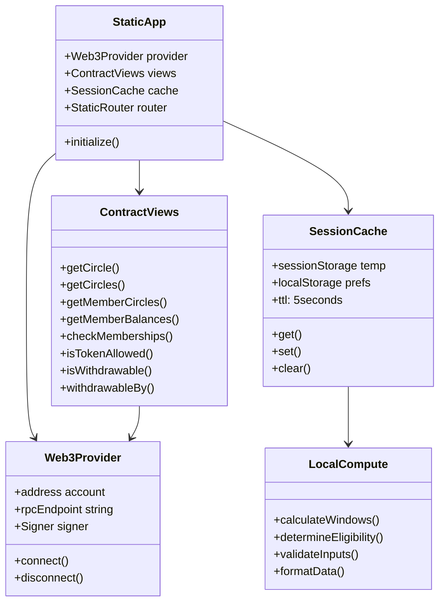

### Circle Lifecycle State Machine

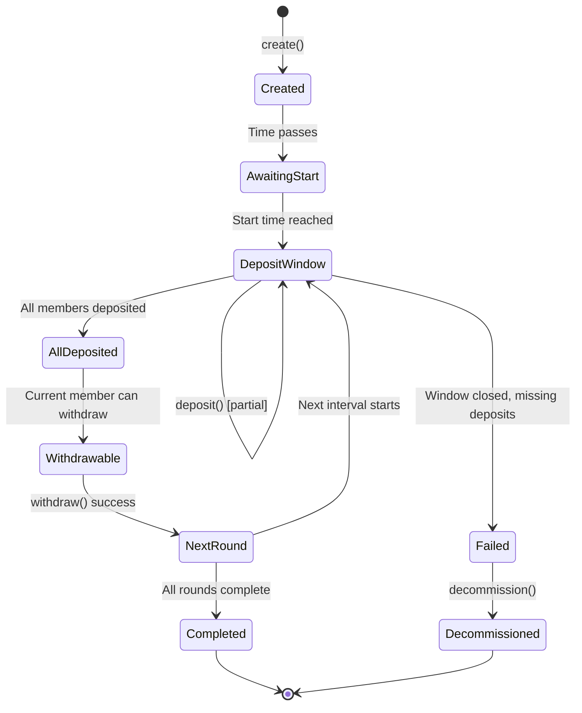

### Static Data Flow (No Database, Direct Contract Reads)

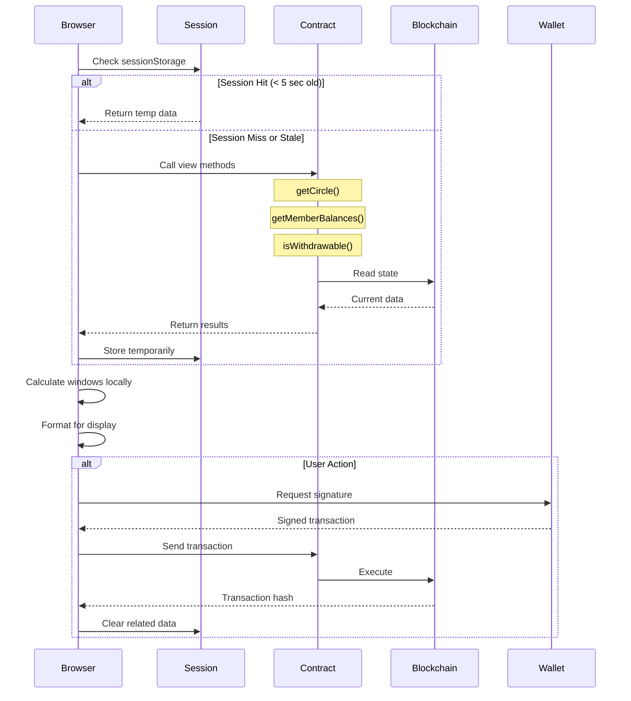

### Static App Data Loading Strategy (No Persistence)

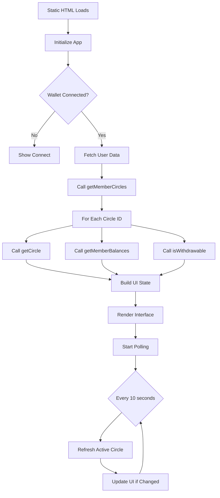

## 6. User Flow Sequence Diagrams

### 6.1 Wallet Connection Flow (No Database)

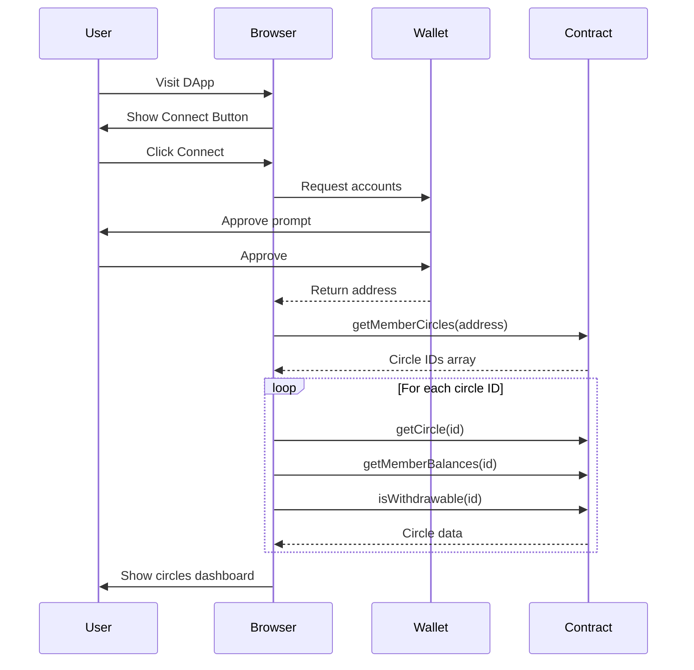

### 6.2 Circle Creation Flow (No Database)

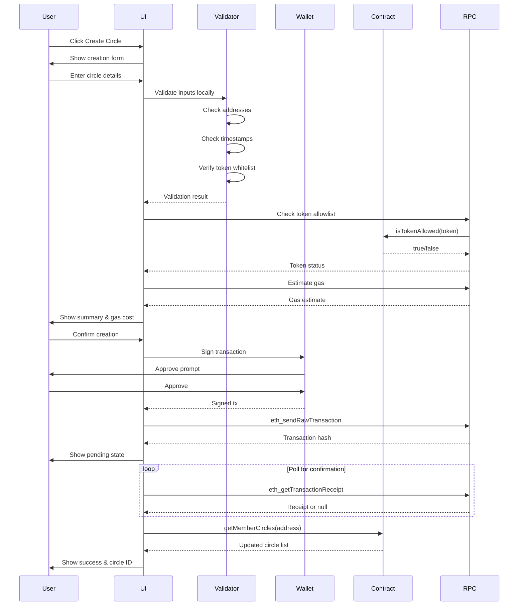

### 6.3 Deposit Flow (Direct Contract Calls)

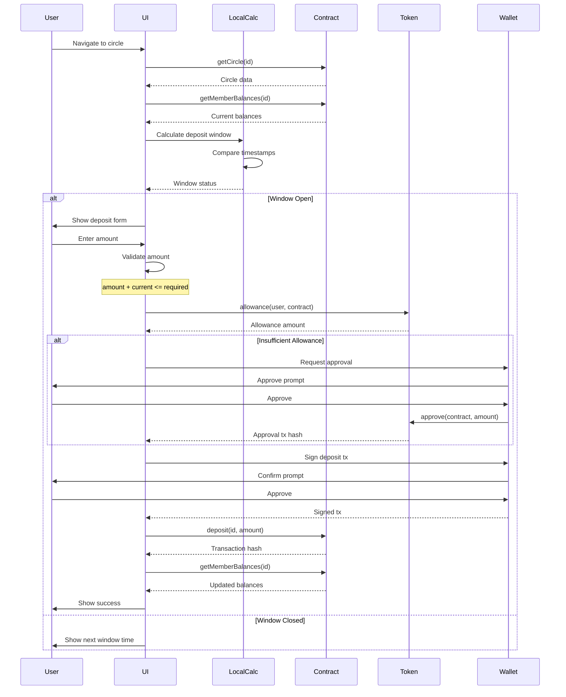

### 6.4 Withdrawal Flow (No Database)

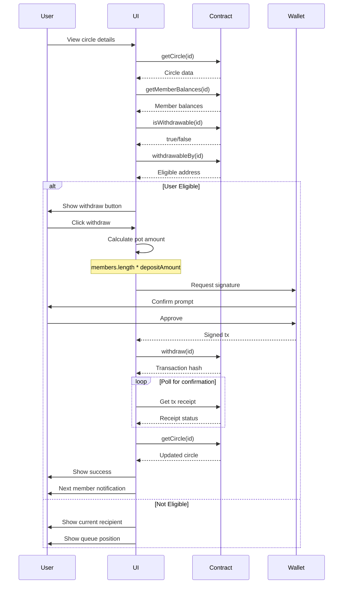

### 6.5 Deposit For Another Member Flow

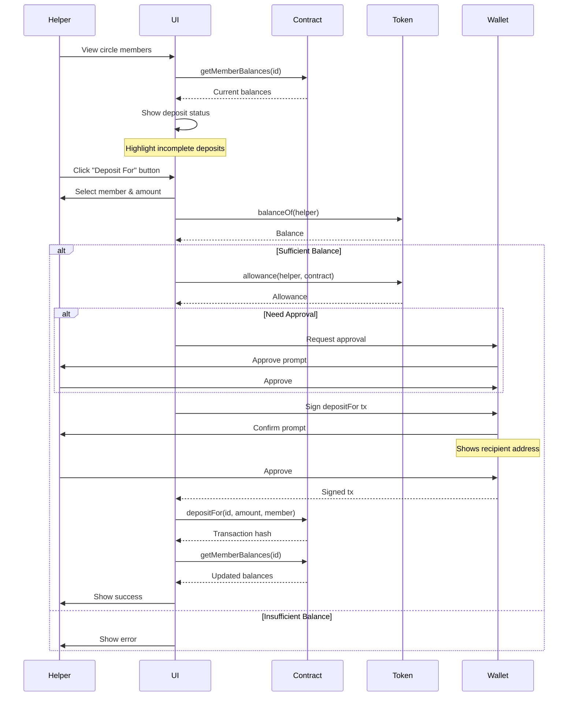

### 6.6 Withdraw For Another Member Flow

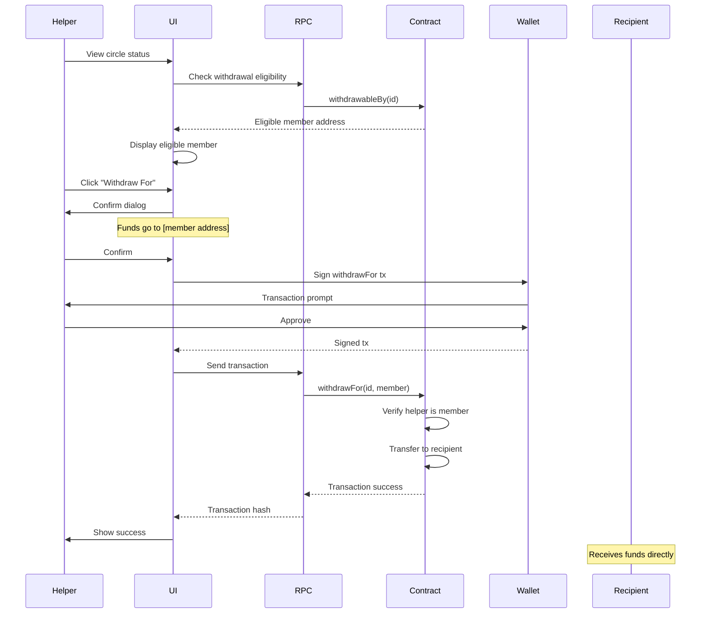

### 6.7 Circle Decommission Flow (No Database)

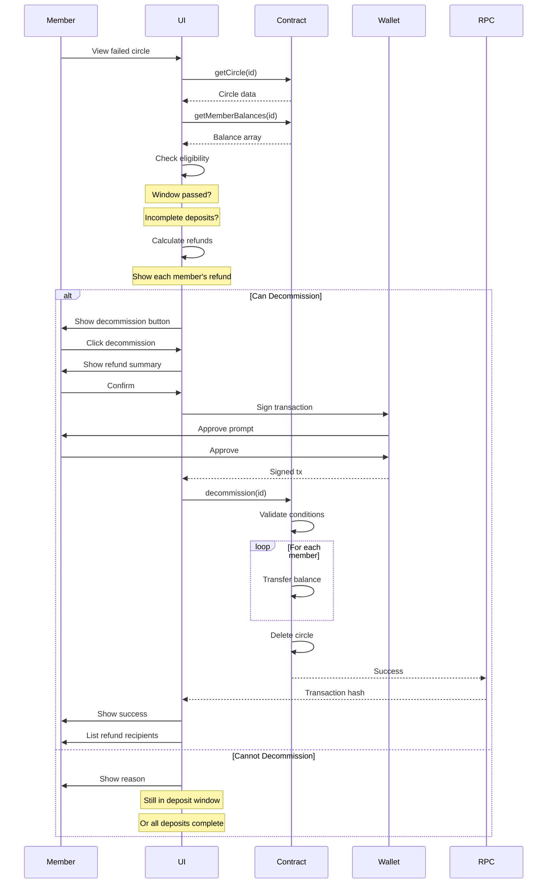

### 6.8 Background Data Polling Flow (No Cache)

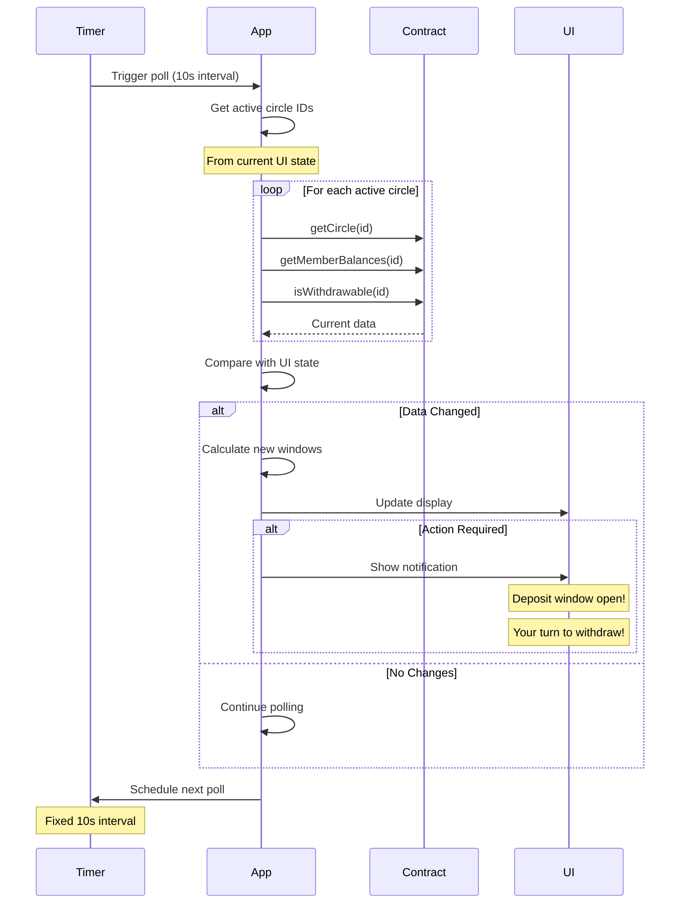

## 7. Edge Cases and Concessions

### Edge Cases Handled
1. **Race condition on last deposit**: Show real-time updates, prevent double deposits
2. **Multiple partial deposits in one window**: Track cumulative balance accurately
3. **Gas estimation failures**: Provide fallback estimates based on recent transactions
4. **Member addresses with no transaction history**: Validate but warn about new addresses
5. **Token approval revoked mid-circle**: Detect and prompt re-approval
6. **Multiple circles with same members**: Clear identification via circle ID and metadata
7. **Deposit exactly at window boundary**: Use block timestamp for deterministic behavior
8. **Network congestion during critical operations**: Queue transactions, allow speed up/cancel

### Design Concessions
1. **No automatic deposits**: Requires manual action (until automation features added)
2. **Fixed member list**: Cannot add/remove members after creation
3. **Sequential withdrawals only**: No skipping turns or reordering
4. **Single token per circle**: Simplifies accounting but limits flexibility
5. **No partial withdrawals**: All-or-nothing withdrawal model
6. **No built-in penalties**: Social pressure only for non-depositors
7. **Owner has no special withdrawal rights**: Democratic model after creation

### Pure Static Implementation (No Database)
1. **Data fetching**: All via contract view methods, no caching
2. **State management**: Memory only, lost on refresh
3. **User preferences**: Minimal localStorage (wallet only)
4. **Session data**: Optional sessionStorage for temp values
5. **Polling strategy**: Fixed intervals, no persistence
6. **RPC optimization**: Batch calls where possible
7. **Error recovery**: Retry with exponential backoff
8. **No offline mode**: Requires active connection

## 8. Open Questions

### Static Deployment Decisions
1. **Hosting Platform**: GitHub Pages, Vercel, IPFS, or Cloudflare Pages?
2. **RPC Providers**: Which public RPCs to include as defaults?
3. **Build Output**: Single HTML file or chunked assets?
4. **CDN Strategy**: Self-host libraries or use CDN links?
5. **Update Mechanism**: How to notify users of new versions?

### Static Architecture Limitations
1. **No Email Notifications**: Only browser notifications available
2. **No Server-Side Automation**: Users must trigger all actions
3. **Limited Historical Data**: Only recent events accessible
4. **No User Accounts**: All data tied to wallet address
5. **No Cross-Device Sync**: Data stays in browser
6. **Rate Limiting**: Public RPC endpoints have limits
7. **No Analytics**: Only client-side tracking possible
8. **Large Data Sets**: Browser memory constraints apply

### Technical Decisions
1. **State Management**: Redux, Zustand, or Valtio?
2. **Caching Strategy**: Local storage, IndexedDB, or service worker?
3. **Build Tooling**: Next.js, Vite, or Create React App?
4. **Testing Strategy**: Unit tests only or E2E with Cypress/Playwright?
5. **Error Tracking**: Sentry, LogRocket, or custom solution?

## 9. Glossary / References

### Terms
- **ROSCA**: Rotating Savings and Credit Association - group savings mechanism
- **Circle**: Instance of a saving group with defined parameters
- **Deposit Window**: Time period when members must make deposits
- **Current Index**: Indicates which member's turn for withdrawal
- **Deposit Interval**: Duration between withdrawal rounds
- **Decommission**: Process to close failed circle and return deposits
- **Pot**: Total accumulated deposits available for withdrawal
- **Round**: Complete cycle of deposits and one withdrawal

### Smart Contract Functions
- `initialize()`: Set up upgradeable contract
- `setTokenAllowed()`: Admin whitelists tokens
- `create()`: Create new circle with parameters
- `deposit()`: Member deposits own funds
- `depositFor()`: Deposit on behalf of another member
- `withdraw()`: Claim pot when eligible
- `withdrawFor()`: Withdraw for another member
- `decommission()`: Close failed circle, return deposits
- `getCircle()`: Fetch single circle details
- `getCircles()`: Fetch multiple circles
- `getMemberCircles()`: Get all circles for a member
- `getMemberBalances()`: Get deposit status for circle
- `checkMemberships()`: Verify membership in circles
- `isTokenAllowed()`: Check if token is whitelisted
- `isWithdrawable()`: Check if withdrawal available
- `withdrawableBy()`: Get current eligible withdrawer

### Pure Static Technical Stack (No Database)
- **Build Tool**: Vite (optimal for static builds)
- **Framework**: React with client-side routing only
- **Styling**: Tailwind CSS (purged for size)
- **Web3**: ethers.js or viem (direct contract calls)
- **State**: React state only (no persistence)
- **Storage**: SessionStorage for temp data only
- **No Service Worker**: No offline support
- **Bundling**: Single bundle for simplicity
- **Deployment**: IPFS, GitHub Pages, Vercel
- **RPC**: Multiple public endpoints
- **Testing**: Vitest + Playwright
